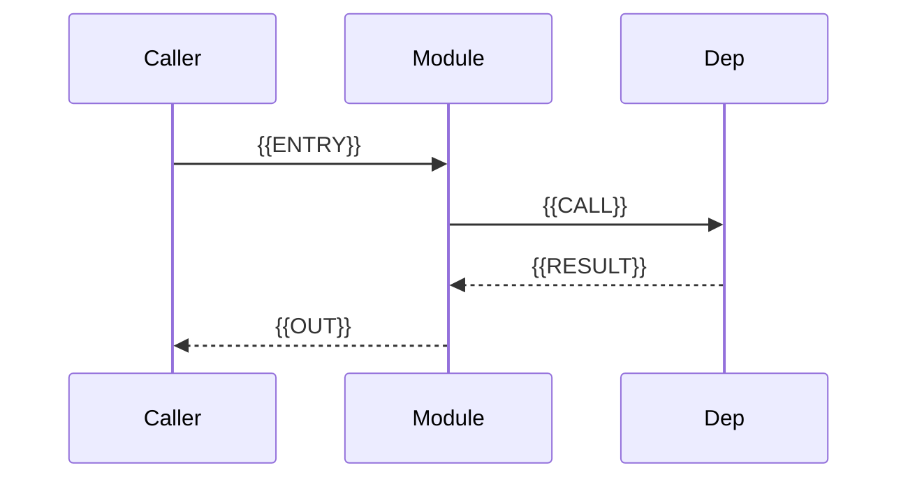

# Modules

{{ONE_LINE_MODULES_SUMMARY}}

This document decomposes the system into **self-contained modules** with **unique responsibilities** and **minimal inter-module dependencies**. Each module is described from a **functional** and a **technical** perspective, with evidence from [Architecture](./architecture.md), [API reference](./api-reference.md), and source code.

## Module map

| Module ID | Name | Primary responsibility | Depends on | Key paths |
|-----------|------|------------------------|------------|-----------|
| `{{MODULE_ID}}` | {{MODULE_NAME}} | {{SHORT_RESPONSIBILITY}} | {{DEPENDS_ON_OR_NONE}} | `{{PATHS}}` |

## Dependency diagram

```mermaid
flowchart LR
  {{MODULE_A}} --> {{MODULE_B}}
  {{MODULE_C}} --> {{MODULE_B}}
```

## Responsibility boundaries

```mermaid
flowchart TB
  subgraph modules [Modules]
    {{MODULE_NODES}}
  end
```

## Design principles applied

- **Unique responsibility:** {{HOW_BOUNDARIES_WERE_CHOSEN}}
- **Self-containment:** {{WHAT_EACH_MODULE_OWNS}}
- **Least coupling:** {{HOW_DEPENDENCIES_WERE_MINIMIZED}}
- **Rejected splits:** {{WHAT_WAS_NOT_SPLIT_AND_WHY}}

---

## Module: {{MODULE_NAME}}

**ID:** `{{MODULE_ID}}`

### Functional perspective

- **Capability:** {{WHAT_BUSINESS_OR_SYSTEM_CAPABILITY}}
- **Actors / consumers:** {{WHO_USES_IT}}
- **Inputs:** {{FUNCTIONAL_INPUTS}}
- **Outputs:** {{FUNCTIONAL_OUTPUTS}}
- **Invariants / rules:** {{BUSINESS_RULES_IF_ANY}}
- **Out of scope:** {{WHAT_THIS_MODULE_MUST_NOT_OWN}}
- **User-visible behavior:** {{BEHAVIOR_NARRATIVE}}

### Technical perspective

- **Location:** `{{SOURCE_PATHS}}`
- **Key types / entry points:** {{SYMBOLS}}
- **Public interface:** {{APIS_EVENTS_EXPORTS}}
- **Internal collaborators:** {{INTERNAL_TYPES}}
- **Data owned:** {{TABLES_COLLECTIONS_FILES_OR_NONE}}
- **External integrations:** {{THIRD_PARTY_OR_NONE}}
- **Configuration:** {{CONFIG_KEYS_OR_NONE}}
- **Threading / async:** {{ASYNC_OR_NONE}}

### Internal flow



{{INTERNAL_FLOW_NARRATIVE}}

### Dependencies

| Direction | Module | Why needed | Coupling notes |
|-----------|--------|------------|----------------|
| Depends on | `{{OTHER_ID}}` | {{REASON}} | {{INTERFACE_OR_DIRECT}} |
| Used by | `{{OTHER_ID}}` | {{REASON}} | {{INTERFACE_OR_DIRECT}} |

### Failure modes and edge cases

| Scenario | Behavior | Evidence |
|----------|----------|----------|
| {{SCENARIO}} | {{BEHAVIOR}} | `{{PATH}}` |

### Evidence

| Claim | Source |
|-------|--------|
| {{CLAIM}} | `{{PATH_OR_DOC_SECTION}}` |

---

<!-- Repeat the "Module:" section for each module with the same depth. -->

## Cross-cutting concerns

| Concern | Where handled | Why not a module | Notes |
|---------|---------------|------------------|-------|
| {{CONCERN}} | `{{PATH}}` | {{REASON}} | {{NOTES}} |

## Coupling analysis

| Edge | Strength (low/med/high) | Can it be reduced? | Notes |
|------|-------------------------|--------------------|-------|
| `{{A}}` → `{{B}}` | {{LEVEL}} | {{YES_NO_HOW}} | {{NOTES}} |

## Gaps and follow-ups

- {{GAP_OR_TBD}}
