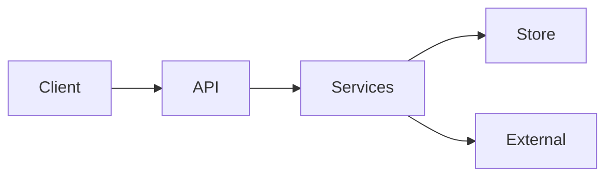

# API reference

{{API_SURFACE_SUMMARY}}

Document the **full public surface** found in code. Prefer completeness over brevity: every public HTTP endpoint, CLI command, or exported API should appear here with parameters and response shape derived from DTOs/handlers.

## Overview

| Surface | Present? | Entry points | Evidence |
|---------|----------|--------------|----------|
| HTTP API | {{YES_NO}} | `{{PATHS}}` | `{{PATH}}` |
| CLI | {{YES_NO}} | `{{PATHS}}` | `{{PATH}}` |
| Library exports | {{YES_NO}} | `{{PATHS}}` | `{{PATH}}` |



## Authentication and authorization

{{AUTH_NARRATIVE}}

| Mechanism | Roles / scopes | How enforced | Evidence |
|-----------|----------------|--------------|----------|
| {{MECH}} | {{ROLES}} | {{ANNOTATION_OR_FILTER}} | `{{PATH}}` |

## HTTP API

Base URL / context path: `{{BASE_URL}}`

### Endpoint index

| Method | Path | Summary | Auth | Handler |
|--------|------|---------|------|---------|
| {{METHOD}} | `{{PATH}}` | {{SUMMARY}} | {{AUTH}} | `{{SOURCE}}` |

### {{ENDPOINT_NAME}}

- **Method / path:** `{{METHOD}} {{PATH}}`
- **Summary:** {{SUMMARY}}
- **Auth:** {{AUTH_REQUIREMENTS}}
- **Handler:** `{{SOURCE_FILE}}` → `{{METHOD_OR_FUNCTION}}`
- **Service / use-case:** `{{SERVICE_CALL}}`

#### Request

| Parameter | In | Type | Required | Validation | Description |
|-----------|-----|------|----------|------------|-------------|
| {{NAME}} | path/query/body/header | {{TYPE}} | {{REQ}} | {{CONSTRAINTS}} | {{DESC}} |

**Request body schema** (from DTO / record / OpenAPI if present):

```{{LANGUAGE}}
{{REQUEST_SCHEMA_OR_EXAMPLE}}
```

#### Response

| Status | Meaning | Body type |
|--------|---------|-----------|
| {{CODE}} | {{MEANING}} | {{TYPE}} |

**Response body schema:**

```{{LANGUAGE}}
{{RESPONSE_SCHEMA_OR_EXAMPLE}}
```

#### Behavior notes

{{SIDE_EFFECTS_ASYNC_VALIDATION_PAGINATION}}

#### Errors

| Condition | Status / error | Evidence |
|-----------|----------------|----------|
| {{CONDITION}} | {{STATUS}} | `{{PATH}}` |

---

<!-- Repeat "### {{ENDPOINT_NAME}}" for every public endpoint. Do not collapse into a table-only doc. -->

## CLI

Invocation: `{{CLI_BIN}}`

| Command | Description | Source |
|---------|-------------|--------|
| `{{COMMAND}}` | {{DESCRIPTION}} | `{{SOURCE_FILE}}` |

### `{{COMMAND}}`

{{COMMAND_DETAILS}}

**Flags / args:**

| Flag | Required | Description |
|------|----------|-------------|
| {{FLAG}} | {{REQ}} | {{DESC}} |

---

## Library / module exports

| Export | Kind | Description | Source |
|--------|------|-------------|--------|
| `{{SYMBOL}}` | {{KIND}} | {{DESCRIPTION}} | `{{SOURCE_FILE}}` |

### `{{SYMBOL}}`

{{SYMBOL_DETAILS}}

**Signature / contract:**

```{{LANGUAGE}}
{{SIGNATURE}}
```

---

## Error model

{{ERROR_NARRATIVE}}

| Error type / code | When | Shape | Evidence |
|-------------------|------|-------|----------|
| {{ERROR}} | {{WHEN}} | {{SHAPE}} | `{{PATH}}` |

## Pagination, filtering, and sorting

{{PAGINATION_NOTES_OR_NONE}}

## Gaps

- {{GAP_OR_TBD}}
