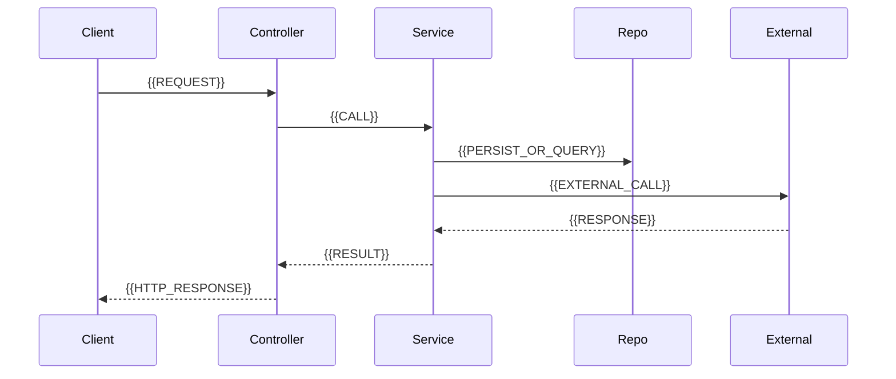

# Architecture

{{ONE_LINE_ARCHITECTURE_SUMMARY}}

This document explains how the system is structured, how requests and jobs flow through it, and how major components collaborate. Claims cite source paths.

## System context

### Purpose

{{PURPOSE_PARAGRAPH}}

### Actors and external systems

| Actor / system | Type | Interaction | Evidence |
|----------------|------|-------------|---------|
| {{ACTOR}} | {{user/service/db/api}} | {{HOW}} | `{{PATH}}` |

### Context diagram

```mermaid
flowchart LR
  subgraph actors [Actors]
    {{ACTOR_NODES}}
  end
  subgraph system [{{SYSTEM_NAME}}]
    {{SYSTEM_NODE}}
  end
  subgraph externals [External systems]
    {{EXTERNAL_NODES}}
  end
  actors --> system
  system --> externals
```

## Logical architecture

### Layer / package overview

Describe the layering or package structure as it exists in the repo (e.g. controller → service → repository → client).

| Layer | Responsibility | Typical packages / paths |
|-------|----------------|--------------------------|
| {{LAYER}} | {{RESPONSIBILITY}} | `{{PATHS}}` |

### Component diagram

```mermaid
flowchart TB
  subgraph presentation [Presentation]
    {{PRESENTATION_NODES}}
  end
  subgraph domain [Domain / application]
    {{DOMAIN_NODES}}
  end
  subgraph infrastructure [Infrastructure]
    {{INFRA_NODES}}
  end
  presentation --> domain
  domain --> infrastructure
```

## Components (detailed)

Document **every major component** found in code (controllers, coordinators/facades, domain services, repositories, AI/clients, security, config). Do not stop at a 3–4 bullet overview.

### {{COMPONENT_NAME}}

- **Location:** `{{PATH}}`
- **Responsibility:** {{RESPONSIBILITY}}
- **Key types:** {{KEY_SYMBOLS}}
- **Inbound collaborators:** {{WHO_CALLS_IT}}
- **Outbound collaborators:** {{WHAT_IT_CALLS}}
- **Inputs / outputs:** {{IO}}
- **Failure modes / edge cases:** {{FAILURES_OR_TBD}}
- **Evidence:** `{{FILE_LIST}}`

{{COMPONENT_NARRATIVE}}

<!-- Repeat for each major component. Prefer 1–3 paragraphs of narrative plus the bullets above. -->

## Runtime / request flows

Document the **primary** flows with sequence diagrams and narrative. Include at least the main happy path and one important secondary flow (e.g. auth, async AI, history search) when present in code.

### Flow: {{FLOW_NAME}}

**Trigger:** {{TRIGGER}}

**Steps (narrative):**

1. {{STEP_1}}
2. {{STEP_2}}
3. {{STEP_N}}



**Error / edge behavior:** {{ERRORS}}

**Evidence:** `{{PATHS}}`

## Data model and persistence

| Entity / collection | Purpose | Key fields | Source |
|---------------------|---------|------------|--------|
| {{ENTITY}} | {{PURPOSE}} | {{FIELDS}} | `{{PATH}}` |

```mermaid
erDiagram
  {{ENTITY_A}} ||--o{ {{ENTITY_B}} : {{RELATION}}
```

<!-- Use erDiagram when relationships are clear; otherwise describe in prose and mark TBD. -->

## Cross-cutting concerns

| Concern | How implemented | Config / entry | Evidence |
|---------|-----------------|----------------|----------|
| AuthN / AuthZ | {{HOW}} | `{{PATH}}` | `{{PATH}}` |
| Validation | {{HOW}} | `{{PATH}}` | `{{PATH}}` |
| Async / messaging | {{HOW_OR_NONE}} | `{{PATH}}` | `{{PATH}}` |
| Observability | {{HOW_OR_NONE}} | `{{PATH}}` | `{{PATH}}` |
| Error handling | {{HOW}} | `{{PATH}}` | `{{PATH}}` |

## Dependencies and integrations

| Dependency | Role | Protocol / client | Where configured | Evidence |
|------------|------|-------------------|------------------|----------|
| {{NAME}} | {{ROLE}} | {{HTTP/SDK/DB}} | `{{CONFIG}}` | `{{PATH}}` |

## Configuration

| Variable / key | Purpose | Default (if known) | Source |
|----------------|---------|-------------------|--------|
| `{{KEY}}` | {{PURPOSE}} | {{DEFAULT}} | `{{PATH}}` |

## Deployment topology

<!-- Only if evidenced: Docker, Compose, K8s, cloud run, etc. -->

{{DEPLOYMENT_NARRATIVE}}

```mermaid
flowchart TB
  subgraph runtime [Runtime]
    {{RUNTIME_NODES}}
  end
  subgraph data [Data]
    {{DATA_NODES}}
  end
  runtime --> data
```

## Design decisions and trade-offs

For each notable pattern visible in code (layering, facades, strategy/AI providers, async, etc.):

### {{DECISION_NAME}}

- **Observation:** {{WHAT}}
- **Why it matters:** {{IMPACT}}
- **Evidence:** `{{PATHS}}`
- **Risks / constraints:** {{RISKS_OR_TBD}}

## Gaps

- {{GAP_OR_TBD}}
