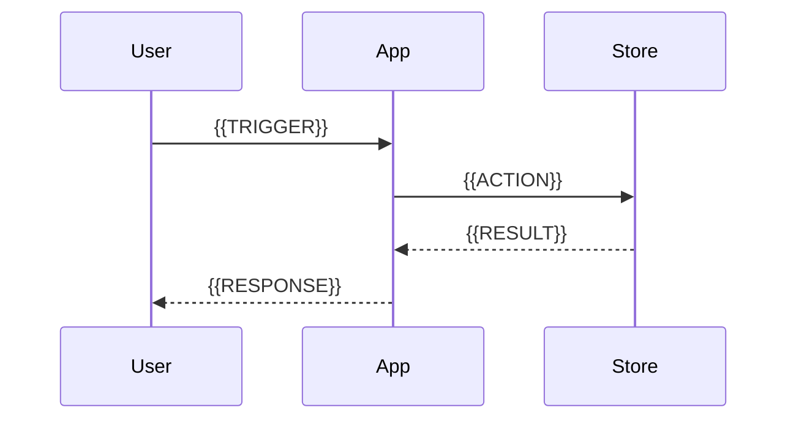

# Architecture

{{ONE_LINE_ARCHITECTURE_SUMMARY}}

## System context

<!-- What external actors and systems interact with this software -->

{{SYSTEM_CONTEXT}}

## High-level diagram

```mermaid
flowchart TB
  subgraph clients [Clients]
    {{CLIENT_NODES}}
  end
  subgraph app [Application]
    {{APP_NODES}}
  end
  subgraph external [External services]
    {{EXTERNAL_NODES}}
  end
  clients --> app
  app --> external
```

## Components

<!-- One subsection per major component; cite source directories/files -->

### {{COMPONENT_NAME}}

- **Location:** `{{PATH}}`
- **Responsibility:** {{RESPONSIBILITY}}
- **Key types / modules:** {{KEY_SYMBOLS}}

## Data flow

<!-- Main request, job, or event flow -->



{{NARRATIVE_DATA_FLOW}}

## Dependencies

| Dependency | Role | Where configured |
|------------|------|------------------|
| {{NAME}} | {{ROLE}} | `{{CONFIG_PATH}}` |

## Configuration

| Variable / key | Purpose | Default (if known) |
|----------------|---------|-------------------|
| `{{KEY}}` | {{PURPOSE}} | {{DEFAULT}} |

## Deployment

<!-- Only if evidenced: Docker, K8s, PaaS, etc. -->

{{DEPLOYMENT_NOTES}}

## Design notes

<!-- Patterns observed: layering, DI, event-driven, monolith vs services -->

{{DESIGN_NOTES}}
